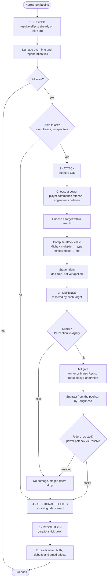

# LMNTLZ · Mechanics 04 — The Turn

A turn belongs to **one hero**. Everything below happens inside that hero's
turn, in this order, every time. There are no interrupts and no reactions — a
defender never takes an action out of sequence, it only contributes its stats
when the Defense phase asks for them.

This file covers what happens **within** a turn. It does **not** cover who acts
next or how often — that is the `Speed` question, still open, and deliberately
separated out below.

---

## The five phases

| # | Phase | Resolves | Acting hero's role |
|---|---|---|---|
| 1 | **Upkeep** | Effects already on the hero — damage over time, crowd control, anything ticking | Passive; may lose the turn here |
| 2 | **Attack** | Power choice, target choice, attack value. Riders are *staged*, not applied | Acts |
| 3 | **Defense** | Evasion, mitigation, resistance. Damage lands here | Passive; the **target** resolves |
| 4 | **Additional effects** | Riders that survived the Defense phase now enact | — |
| 5 | **Resolution** | Durations tick. Buffs, debuffs and timed effects expire | — |

The split that matters: **phase 2 computes, phase 3 decides.** The attacker
never knows what it dealt until the defender has had its say. Riders are the
same — staged in Attack, contested in Defense, enacted in Additional Effects.

---

## Flow

Two branches deserve calling out, because both are forced rather than chosen:

- **A hero that cannot act still reaches Resolution.** Otherwise a stun would
  tick down only on turns where the victim was already free to act, and no
  crowd control would ever expire. Losing the turn skips phases 2–4, never 5.
- **Death in Upkeep ends the turn immediately.** A hero killed by its own
  damage-over-time never acts, so there is nothing for phases 2–4 to do.

---

## What each phase does

### 1 · Upkeep — the bill comes due

Everything already attached to this hero resolves **on this hero's own turn**,
not on the turn of whoever applied it. A poison you inflict ticks when your
victim acts.

That has a consequence worth stating now, because it will matter when `Speed`
is settled: **the more often a hero acts, the more damage-over-time it eats.**
Turn frequency is not a pure benefit. If Speed ends up granting extra turns,
it also multiplies the cost of every debuff on the board.

Upkeep is also where a hero discovers it has lost the turn. Crowd control is
*resolved* here — checked, applied, and this is where "you are stunned, you do
not act" is decided.

### 2 · Attack — declare, don't apply

The acting hero picks a power and a target. **The player commands offense; the
engine commands every defense squad** — so on defense this is where the AI
chooses, which is why `07-defense-ai.md` is a turn-phase problem and not a
separate system.

The attack value is computed here in full: base damage from `Might` and the
power's multiplier, then type effectiveness from the Bane/Fault derivation,
then crit. What is **not** done here is anything to the target — no damage, no
status. Riders are *staged*: declared, carried into the next phase, and still
capable of being refused.

### 3 · Defense — the target answers

Per target, in order: does it land, how much is absorbed, apply the remainder,
then contest each staged rider.

`Perception` vs `Agility` decides landing. A miss ends resolution for that
target and its staged riders drop with it. Mitigation is `Armor` for the three
martial types and `Magic Resist` for the six arcane ones, both reduced by the
attacker's `Penetration`. What survives comes off the pool that `Toughness`
sets.

Riders are contested separately from the damage — power potency against
`Resolve` — so a hit can land its damage and still fail to land its debuff.

### 4 · Additional effects — riders enact

Whatever survived phase 3 now happens: applied debuffs, buffs on the attacker,
lifesteal, chained or splash effects, anything the power promised beyond its
damage number.

### 5 · Resolution — the clock moves

Durations tick and anything that has run out expires. This is the only phase
that runs unconditionally, and that is what makes timed effects trustworthy.

---

## How this maps to the damage pipeline

`01-stats.md` specifies an eight-step damage resolution pipeline. It is not a
separate model — it is **phases 2–4 in detail**:

| Pipeline step | Phase |
|---|---|
| 1 · Act | *outside* — turn order, still open |
| 2 · Land | 3 · Defense |
| 3 · Base | 2 · Attack |
| 4 · Type | 2 · Attack |
| 5 · Crit | 2 · Attack |
| 6 · Mitigate | 3 · Defense |
| 7 · Apply | 3 · Defense |
| 8 · Status | 3 · Defense *(contested)* → 4 · Additional effects *(applied)* |

**One ordering changed.** The pipeline listed *Land* as step 2, before base
damage was computed; the phase structure computes the whole attack value first
and tests landing in the Defense phase. The outcome is identical for an
ordinary attack — a miss voids the damage either way — but it is not identical
for a power with an **on-miss rider**, which now has a fully-computed attack
value available to scale from. The phase structure wins; `01-stats.md` step 2
should be read as "resolved in the Defense phase."

Pipeline step 8 is the only one that splits across two phases, and that split
is the point: **contested in Defense, enacted in Additional Effects.**

---

## What this settles, and what it doesn't

**Settled:** the five phases, their order, that they are per-hero, that Upkeep
resolves effects on the acting hero, that riders stage in Attack and contest in
Defense, and that Resolution always runs.

**Not settled, and not blocked by Speed** — these are intra-turn and can be
answered now:

### 1. Where do cooldowns tick?

Cooldowns are counted in whole turns (settled). Nothing yet says *when* the
counter moves. Upkeep and Resolution are both defensible, and they differ by
exactly one turn of availability — so **every cooldown number in
`03-powers.md` is ambiguous until this is answered.** Resolution is the natural
home, since it is already the phase that moves clocks and the only one that
always runs; Upkeep would mean a hero that loses its turn to a stun still gets
its cooldowns back, which may be the more forgiving choice.

### 2. Does a dead target still resolve phases 4 and 5?

If damage in phase 3 kills the target, it is unclear whether a rider still
enacts on it. It matters concretely: lifesteal on the attacker probably should
fire, a poison applied to a corpse probably should not, and a kill that
triggers an on-death effect needs a defined moment to do it in.

### 3. Multi-target: how many times does each phase run?

The Defense phase is stated as per-target and that is unambiguous. Additional
Effects is not — a power that hits three targets and buffs its caster should
buff once, not three times, so phase 4 likely needs splitting into per-target
riders and per-cast riders.

### 4. Can a rider be applied by a power that deals no damage?

A pure buff or a pure debuff has nothing for phase 3 to mitigate. It presumably
still runs the phase for the `Resolve` contest and skips the damage steps —
worth writing down rather than leaving to implementation.

---

## Still parked: what Speed does

Phase 1 of the damage pipeline — **Act** — is the one step this document does
not place, because it happens between turns rather than inside one. Whether
`Speed` grants extra turns, only orders them, or drives cooldown ticks remains
open (`01-stats.md`, open question 2), and remains **parked by decision**.

The useful thing is that it turns out to be separable. The five phases hold
whatever the answer is: extra turns simply run the sequence again, and a pure
ordering model changes nothing here at all. **Intra-turn structure was never
actually blocked on Speed** — which is why this file exists ahead of it.
