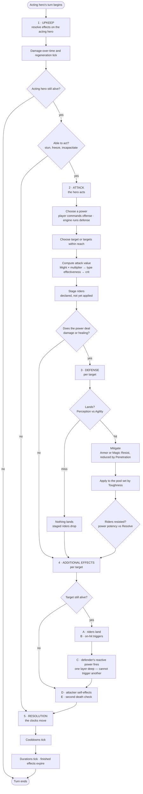

# LMNTLZ · Mechanics 04 — The Turn

A turn belongs to **one hero** — the *acting* hero. Everything below happens
inside that hero's turn, in this order, every time.

**There are no interrupts.** Nothing a defender does can pause, reorder or
pre-empt the sequence. A defender *can* act — a counter or riposte — but only
inside the attacker's phase 4, at a fixed point, one layer deep, and never in a
way that changes what comes next. Reaction is a step in the attacker's turn, not
a turn of its own.

**The phase order is the attacker's.** This is the single most useful thing to
hold onto, because it answers most questions about edge cases before they get
asked. A defender dying mid-turn is an *event inside* the acting hero's turn,
not something that can end it. The only death that stops the sequence is the
acting hero's own, and the only place that can happen is Upkeep.

This file covers what happens **within** a turn first, then who acts next and
how often — `Speed`, settled at the end.

---

## The five phases

| # | Phase | Resolves | Runs |
|---|---|---|---|
| 1 | **Upkeep** | Effects already on the acting hero — damage over time, crowd control, anything ticking | Always |
| 2 | **Attack** | Power choice, target choice, attack value. Riders are *staged*, not applied | Unless the hero cannot act |
| 3 | **Defense** | Evasion, mitigation, resistance. Damage or healing lands here | Per target — **skipped** if the power does neither |
| 4 | **Additional effects** | Riders enact. For a power with no damage or healing, they are contested here too | Per target |
| 5 | **Resolution** | Cooldowns tick. Durations tick. Timed effects expire | Always |

The split that carries the design: **phase 2 computes, phase 3 decides.** The
attacker never knows what it dealt until the defender has had its say. Riders
work the same way — staged in Attack, contested in Defense, enacted in
Additional Effects.

---

## Flow



Three branches deserve calling out, because all three are forced rather than
chosen:

- **A hero that cannot act still reaches Resolution.** Otherwise a stun would
  tick down only on turns where the victim was already free to act, and no
  crowd control would ever expire. Losing the turn skips phases 2–4, never 5.
- **Death in Upkeep ends the turn immediately.** A hero killed by its own
  damage-over-time never acts, so there is nothing for phases 2–4 to do. This
  is the *only* way the sequence terminates early.
- **A target dying never ends the sequence.** It is the attacker's turn. The
  corpse stops receiving things; the turn carries on.

There is also a **third way to lose the action**, which falls out of the reach
rule rather than from anything here: a hero with **no legal target in reach**
passes. At full formation the back-row hero cannot touch an enemy at all
(`02-squads.md`), so this is an ordinary occurrence, not an edge case — and a
pass still reaches Resolution, so it still recharges.

---

## What each phase does

### 1 · Upkeep — the bill comes due

Everything already attached to this hero resolves **on this hero's own turn**,
not on the turn of whoever applied it. A poison you inflict ticks when your
victim acts.

Because durations tick on the same clock (phase 5), **a damage-over-time effect
deals its full total no matter how fast its bearer is** — a 3-turn burn ticks
exactly three times. What `Speed` changes is the rate: a fast hero takes it
compressed into fewer rounds and is clean sooner. See *One clock per hero*
below.

Upkeep is also where a hero discovers it has lost the turn. Crowd control is
*resolved* here — checked, applied, and this is where "you are stunned, you do
not act" is decided.

### 2 · Attack — declare, don't apply

The acting hero picks a power and a target.

**Who is choosing depends only on which squad the acting hero belongs to.** The
attacking player commands every hero in the attack squad; the engine commands
every hero in the defense squad. **The AI never plays an attack squad** — there
is no battle in which offense is engine-run, in either direction. That is why
`07-defense-ai.md` is a turn-phase problem rather than a separate system: it is
this phase, for half the heroes on the board.

The attack value is computed here in full: base damage from `Might` and the
power's multiplier, then type effectiveness from the Bane/Fault derivation,
then crit. What is **not** done here is anything to the target — no damage, no
status. Riders are *staged*: declared, carried into the next phase, and still
capable of being refused.

#### Target eligibility

Reach decides who a hero *can* physically touch. It is the first stage of
choosing a target, not the whole of it — effects can narrow the field further
or force a choice within it. Resolving them in a fixed order:

| | Stage | What it does |
|---|---|---|
| 1 | **Reach** | Build the candidate set: every hero at row distance ≤ reach, on the side the power wants |
| 2 | **Filters** | Effects that *remove* candidates — **fade**, and anything else that hides a hero |
| 3 | **Compulsion** | Effects that *force* a choice among what survives — **taunt** |
| 4 | **Choice** | The player, or the engine, picks from what remains |

Two invariants hold the whole thing together, and both exist to make an
unresolvable board impossible:

> **A filter that would empty the candidate set is ignored.**
> **A compulsion naming a hero outside the candidate set does not apply.**

**Taunt** compels, and it compels **only within reach**:

> An attacker that **can** reach the taunter must target the taunter.
> An attacker that **cannot** reach the taunter chooses normally, as though the
> taunt did not exist.

Taunt narrows a candidate set; it never extends one. It cannot pull a hero into
range, cannot override the reach rule, and cannot make an unreachable hero the
only legal target. Every attacker on the board evaluates it separately, against
its own reach and its own row — so the same taunt can bind the enemy front line
and leave their back line entirely free.

That is the second invariant, and it exists for a concrete reason: without it, a
taunter parked in the enemy back row would blank the opposing front line's turns
while never being touchable itself.

**Fade** filters: a faded hero cannot be targeted while a non-faded ally is
available to be targeted instead. It is not invulnerability — it is a queue
position. Once the attacker has nothing else it can hit, the first invariant
fires and the faded hero is targetable like anyone else.

That first invariant is what keeps fade honest, and it produces a property worth
designing around: **fade is only ever as strong as the heroes standing in front
of it.** A squad where *every* hero is faded gets nothing at all — the filter
would empty every candidate set, so it is ignored every time. Fade is a
protection effect that must be paid for by an unfaded body.

The invariants also foreclose the degenerate case. Without them a squad could
make itself collectively untargetable and the battle would never end, on a
server that resolves turns without a clock to time out against.

**Taunt and fade cancel.** They are opposites — one demands attention, the
other avoids it — and **no hero should ever carry both**. If one somehow does,
neither applies: the hero is targeted exactly as if it were clean, neither
filtered out nor compelling anyone. No precedence rule, no stacking, no
ordering to remember.

Cancellation is *per hero*, not global. A faded hero standing behind a taunting
ally is the ordinary case and works as expected — the taunt compels, the fade
hides, and they never meet. It is only the two of them landing on the **same**
hero that voids both.

The stage order still matters for effects other than these two. A compelling
hero that some future filter removes from the candidate set cannot bind anyone,
by the second invariant — a hero has to be targetable before it can demand to be
targeted.

Three consequences that fall out rather than needing their own rules:

- **These modify hostile targeting only.** Reach is one rule for allies and
  enemies alike (`02-squads.md`), but taunt is not — a taunt that redirected
  your healer would be nonsense. Any effect in stages 2–3 declares which side's
  targeting it touches.
- **A power that makes no choice ignores compulsion.** Taunt binds the *choice*
  at stage 4. A power that hits everything eligible has no choice to bind, so it
  hits the taunter along with everyone else.
- **They are ordinary status effects.** Taunt and fade are applied as riders in
  phase 4, contested against `Resolve` in phase 3, and tick down on their
  bearer's own turns like anything else. What they *are* belongs in
  `05-status.md`; only their effect on targeting belongs here.

This is also the first mechanic that constrains the **player's** choice rather
than the engine's. Reach limits what you can reach; taunt tells you what you
must hit. Worth watching in playtest — compulsion is the kind of thing that
reads as depth when it is rare and as a straitjacket when it is common.

### 3 · Defense — the target answers

**Phase 3 exists to move a number against a health pool.** If a power deals
neither damage nor healing, there is nothing here for it to do and the phase is
skipped entirely — see *Powers that skip Defense* below.

Otherwise, per target, in order: does it land, how much is absorbed, apply the
remainder, then contest each staged rider.

`Perception` vs `Agility` decides landing. A miss ends resolution for that
target and its staged riders drop with it. Mitigation is `Armor` for the three
martial types and `Magic Resist` for the six arcane ones, both reduced by the
attacker's `Penetration`. What survives comes off the pool that `Toughness`
sets. Healing runs the same phase — it is the same operation with the sign
reversed, and it is reach-limited exactly as an attack is.

Riders are contested separately from the damage — power potency against
`Resolve` — so a hit can land its damage and still fail to land its debuff.

### 4 · Additional effects — everything that isn't the strike

Five sub-steps, in this order:

| | Step | What happens |
|---|---|---|
| A | **Riders land** | Each rider that survived phase 3 is written on with its full duration. An existing stack refreshes rather than doubling, unless the power says otherwise |
| B | **On-hit triggers** | Conditional on the strike landing: lifesteal, chains, execute thresholds |
| C | **Reactive powers** | The defender's counters and retaliations fire |
| D | **Attacker self-effects** | The attacker's own buffs, costs and recoil |
| E | **Second death check** | Reactions and recoil can kill |

The order is doing work at both ends. **Riders before triggers** so an execute
threshold reads a pool the strike has already moved. **Attacker self-effects
last** so the attacker's new state is what carries into Resolution — a hero that
buffs its own Armor is protected from the next turn onward, never retroactively.

**Dead targets receive nothing.** A rider never lands on a corpse. But the
phase still runs — **attacker-side and on-kill effects fire regardless**,
because the target's death is an event inside the attacker's turn, not a stop
condition for it. Lifesteal from the killing blow pays out; poison applied to
the body does not.

**The phase runs per target.** A power that hits three enemies resolves its
riders three times, once against each — and can be countered three times, once
by each survivor. A rider that should happen **once per cast** rather than once
per target — a flat self-buff, say — is therefore a property the *power* has to
declare, following the existing convention in `01-stats.md` that any deviation
from the pipeline must be stated explicitly.

### Reactions

A defender may own a **reactive power** — a counter, a riposte, a retaliation —
which fires at step C of the attacker's phase 4. It is the only way a hero acts
outside its own turn, and it is fenced tightly:

> **A reaction cannot trigger a reaction.** Phase 4 resolves exactly one layer
> deep and stops. Nothing in the phase may begin a new attack.

That fence is not fussiness. Both squads are counter-built by design, so two
squads full of reactive powers would otherwise ping-pong forever on a single
strike — an infinite loop reachable through ordinary play, on a server that
resolves the whole turn before answering the client.

Three things follow from rules already settled, rather than needing their own:

- **A reaction respects reach.** `02-squads.md` states one reach rule with no
  exceptions; a defender that cannot reach its attacker cannot counter it.
- **A dead defender cannot react.** It was removed in phase 3, and phase 4
  gives nothing to corpses.
- **A reactive power has a cooldown like any other**, counted in its *owner's*
  turns and ticking in its owner's Resolution — not the attacker's. So a
  defender under fire from a fast attacker counters at most once per its own
  turn cycle, however many times it is hit.

Two more, **settled 2026-07-27**:

- **A reaction fires on an evaded attack.** Phase 3 previously ended resolution
  for an evaded target entirely; it must now run far enough to reach step C.
  Otherwise `Agility` — the defender's own defensive stat — suppresses the
  defender's own counter, so the better your defense the less you retaliate,
  which nobody designs on purpose. This also resolves a tension already present:
  *How this maps to the damage pipeline* contemplates an **on-miss rider** with
  "a fully-computed attack value available to scale from", which the old wording
  forbade.
- **"Reactive" is a property of the power, not a stance.** A stance could not be
  an in-battle choice anyway — the engine runs defense — so it would be a
  squad-builder toggle like targeting priority. But the obvious cost is already
  spent: a reactive power carries a normal cooldown ticking in its *owner's*
  turns, which already limits a defender to one counter per its own turn cycle.
  A stance with no additional cost is a property wearing a costume, and it would
  be a third configuration layer on every squad row. It stays available as a
  config field once `packages/sim` can price one.

> **Both rules currently govern nothing — there is not a single reactive power in
> the roster.** Searching all 127 powers returns four reaction-flavored entries
> and none of them is one: `Redouble` is a plain tier-1 strike *renamed from
> "Riposte"* for exactly this reason, `One Clean Stroke` references it in flavor
> only, and the other two are **Silka's `Already Gone`** (immunity to being
> targeted by a reactive power) and **Hettamar's `Nothing to Discuss`** (denies
> reactions to anyone he damages).
>
> **So two of the 27 unique passives are dead** — one grants immunity to nothing,
> the other denies nothing. `03-powers.md` makes the unique layer the carrier of
> hero identity, so this is a real gap rather than a curiosity.

**Resolved 2026-07-28: author the reactive powers, do not replace the passives.**
The choice was between authoring the powers those two passives answer and
replacing both passives; authoring wins on three counts.

- **Replacing costs the same work and destroys more.** Two new unique passives is
  comparable authoring effort to a handful of reactive powers — and it retires
  the entire reaction system, which is already fully specified above, to save
  nothing.
- **Reactions are a *defensive* mechanic, and defense is the half the player
  never touches.** A reaction fires on an evaded attack, so it is a thing a
  defending squad does while the engine drives it. That is exactly where
  mechanical variety is scarcest and pays most.
- **It fixes two heroes' identities rather than rewriting them.** `Already Gone`
  and `Nothing to Discuss` are good passives pointed at nothing; the cheapest
  repair is to build the target.

**How many, and on whom, belongs to the hero-numbers pass** (see
`README.md` → *Parked*). A reaction wants high `Agility` to fire at all, so the
assignment is downstream of the stat pass and should not be guessed before it.
One sizing note for whoever does it: at 6 heroes drawn from 27, **a single
reactive hero already appears in ~22% of enemy squads**, so this does not need
many to stop being dead.

### 5 · Resolution — the clocks move

**Cooldowns tick here.** Powers recharge in whole turns, and Resolution is
where that counter moves. Resolution is also the only phase that always runs,
which means a hero that loses its turn to a stun still recharges — the stun
costs it the action, not the recovery.

Durations tick in the same phase, and anything that has run out expires. One
phase, one place where time passes, and it is unconditional. That is what makes
timed effects trustworthy.

**Both tick only for the hero whose turn it is.** A duration counts down on its
**bearer's** turn, exactly as damage-over-time ticks on its bearer's turn in
Upkeep — the two must use the same clock or they desynchronise. If every effect
on the board ticked on every hero's turn, a 3-turn burn facing a full 12-hero
board would expire after a quarter of a round having dealt damage once. "Turns"
in a duration always means *the bearer's own turns*.

A consequence, and the reason Resolution ticking **last** matters: an effect
applied during this turn is applied in phase 4, survives this turn's Resolution
at full duration, and only starts counting on its bearer's next turn. **A
1-turn buff is always usable once.**

### Powers that skip Defense

A power that deals no direct damage and no healing — a pure buff, a pure
debuff, a reposition — has nothing for phase 3 to mitigate, so **phase 3 is
skipped and the whole effect resolves in phase 4**, including its `Resolve`
contest.

The asymmetry is deliberate rather than an oversight. Phase 3 is where the
target physically answers an incoming blow; with no blow, the only question
left is whether the effect sticks, and that is asked at the moment it tries to
land. The practical rule:

> **Damage or healing → contested in phase 3, enacted in phase 4.**
> **Neither → contested and enacted together in phase 4.**

Note that a pure debuff cannot be *evaded* — skipping phase 3 skips the
`Perception` vs `Agility` roll along with everything else. Dodging is a defense
against blows, not against curses; `Resolve` is the only thing standing between
a hero and a pure debuff.

---

## How this maps to the damage pipeline

`01-stats.md` specifies an eight-step damage resolution pipeline. It is not a
separate model — it is **phases 2–4 in detail**:

| Pipeline step | Phase |
|---|---|
| 1 · Act | *outside* — the turn queue, below |
| 2 · Land | 3 · Defense |
| 3 · Base | 2 · Attack |
| 4 · Type | 2 · Attack |
| 5 · Crit | 2 · Attack |
| 6 · Mitigate | 3 · Defense |
| 7 · Apply | 3 · Defense |
| 8 · Status | 3 · Defense *(contested)* → 4 · Additional effects *(applied)* |

**One ordering changed.** The pipeline listed *Land* as step 2, before base
damage was computed; the phase structure computes the whole attack value first
and tests landing in the Defense phase. The outcome is identical for an
ordinary attack — a miss voids the damage either way — but it is not identical
for a power with an **on-miss rider**, which now has a fully-computed attack
value available to scale from. The phase structure wins; `01-stats.md` step 2
should be read as "resolved in the Defense phase."

Pipeline step 8 is the only one that splits across two phases, and that split
is the point: **contested in Defense, enacted in Additional Effects** — except
for a power that skips Defense, where both happen in phase 4.

---

## How a battle ends

Everything above describes what happens *inside* a turn and what happens
*between* turns. This is the outer loop, and until 2026-07-27 no document had it:
every mention of a victory in `06-progression.md` and `08-guilds.md` **pays** for
one without anything defining what one is.

### Death is immediate and total

> **A champion reduced to 0 HP leaves the board at once.**

It does not act again, cannot be targeted, cannot be healed or revived, and —
this is the part that matters — **its row stops counting it as occupied.**

Death is checked continuously, not at a phase boundary. A champion can die in its
own Upkeep to a damage-over-time effect without ever taking its turn, which
`05-status.md` already relies on.

> **"Fully empty" means no *living* champion.** `02-squads.md` skips fully empty
> rows for reach, and describes a row being "wiped" — so this was always the
> intent, but it was never stated. If corpses held their rows, rows would never
> empty, reach would never open up, and the whole *a squad gains reach as it
> loses heroes* dynamic — the thing that gives a losing position its own
> momentum — would silently not exist. It is one sentence and it is load-bearing.

### Victory

**A side wins when all six of the opposing squad have left the board.** There is
no surrender, no flee and no early concession: defense is engine-run, so there is
nobody on the other side to accept one.

### The turn cap

> **A battle is capped at 300 hero-turns.** When the cap is reached the side with
> the **higher share of its pooled HP remaining** wins.

**This is an engineering requirement before it is a design one.** `docs/tech-stack.md`
settles that in-progress battle state is never stored — it is re-derived from the
append-only action log on every request. An unbounded battle is therefore an
unbounded per-request compute cost, which makes an unkillable squad a denial-of-
service vector rather than merely a boring matchup. The cap has to exist before
`packages/sim` does.

**300 is roughly 3× the simulated median.** A 6v6 resolves in about **102**
hero-turns, so the cap sits far enough out that no ordinary battle approaches it
while still bounding the log. It is a tuning constant like any other and has to
be re-checked once healing is numbered — a heal-heavy pairing is the one shape
that could legitimately run long.

> **The margin widened without anyone choosing to widen it.** The cap was set
> against a **155**-hero-turn median, before the `+20` accuracy edge in
> `01-stats.md` cut a 6v6 to ~102. So 300 was ~2× when written and is ~3× now —
> **more headroom than intended, which is the safe direction to drift**, but worth
> knowing before anyone reads 300 as a tuned value.

> **This is the first constant to re-derive from production data.** The ~102
> figure is simulated, and `docs/tech-stack.md` settles that **turn count is
> recorded on every battle's metadata row** precisely so the real distribution is
> knowable. Once it is, set the cap from measured **p99**, not from the median —
> a cap's job is to sit outside the tail, and only the tail says where that is.

Resolution when the cap is reached, in order:

| # | Test |
|---|---|
| 1 | Higher **pooled HP remaining as a share of pooled maximum** |
| 2 | More champions still standing |
| 3 | **The defender holds** |

**Pooled HP share already encodes deaths**, since a fallen champion contributes
zero to the numerator and its full maximum to the denominator — a side with three
down cannot exceed 50%. That is why it leads rather than champion count.

**Why not simply "the attacker loses".** It is the simpler rule and it reads
naturally as *the wall held*, but it hands defenders a live exploit: build a
squad that cannot be killed inside 300 turns and farm hold streaks forever. Hold
streaks are public, they pay 10 shards each, and `02-squads.md` makes them a
tracked stat — so the incentive is real rather than theoretical, and policing it
would become a permanent balance chore. Deciding on remaining HP means a stalling
squad still loses when it is behind, which is the whole point.

**Why not a true draw.** Cleanest incentive-wise, since neither side can farm it,
but an ambush that draws burns a win streak the attacker spent up to 45
consecutive victories building — the single most punishing outcome the game could
produce, applied to its most invested players.

The third tiebreak favours the defender because at that point the attacker chose
the fight and failed to finish it. An exact tie on both HP share and champion
count is vanishingly rare, so the residual stall incentive it creates is not
worth a fourth test.

---

## Settled

The five phases, their order, and:

- A turn belongs to the **acting** hero; the phase order is the attacker's.
- A battle ends when **all six of one side have left the board**, or at a
  **300 hero-turn cap** decided on pooled HP share remaining.
- A champion at 0 HP **leaves the board immediately** and stops occupying its row.
- Upkeep resolves effects **on the acting hero**, on its own turn.
- Losing the turn to crowd control skips phases 2–4 but **always** reaches 5.
- The acting hero dying in Upkeep is the **only** early termination.
- Riders **stage** in Attack and are **contested** in Defense.
- Phase 3 is **skipped** when a power deals neither damage nor healing; that
  power's effect is contested and enacted together in phase 4.
- Phases 3 and 4 both run **per target**.
- **Dead targets receive no follow-on effects**, but the phase still runs and
  attacker-side effects still fire.
- Phase 4 resolves in a fixed order: riders → on-hit triggers → **reactions** →
  attacker self-effects → second death check.
- **A defender may fire a reactive power** at step C, respecting reach, never
  while dead, on its own cooldown — and **a reaction can never trigger another
  reaction**.
- **Cooldowns tick in Resolution**, unconditionally.
- Targeting resolves in four stages — **reach → filters → compulsion → choice**
  — under two invariants: a filter that would empty the candidate set is
  ignored, and a compulsion naming a hero outside that set does not apply.
- **Taunt** compels, **fade** filters, and **the two cancel on the same hero.**
- The **AI plays defense squads only**, never an attack squad.
- **Turn order is a bounded accumulator** — every hero gains `50 + Speed` per
  tick and acts at 100. Speed 45 acts 1.46× as often as Speed 15.

## Open

- ~~**Reaction details.**~~ **Settled** — see *Reactions* above. A reaction
  **fires on an evaded attack**, and **"reactive" is a power property**, not a
  stance. Both currently govern nothing: there is no reactive power in the
  roster, which leaves two unique passives dead.
- ~~**Once-per-cast riders.**~~ **Settled** — `03-powers.md` → *Payload and
  rider*. A rider whose target is the **caster** resolves once per cast; riders
  aimed at whoever the payload struck still resolve per target. Phase 4 is
  unchanged for everything else.

---

## Between turns: what Speed does

Phase 1 of the damage pipeline — **Act** — is the one step that happens between
turns rather than inside one. It is now settled:

> **`Speed` sets initiative order, and faster heroes act more often.**
> Cooldowns are never touched directly by `Speed`; a cooldown counts **hero
> turns**, ticking once per turn its owner takes.

Nothing above changes. Extra turns simply run the five phases again, which is
why the intra-turn structure could be settled first.

### One clock per hero

Every timed quantity in the game counts the **bearer's own turns**: cooldowns
tick in that hero's Resolution, durations tick in that hero's Resolution,
damage-over-time ticks in that hero's Upkeep. Nothing counts rounds and nothing
counts anybody else's turns.

So `Speed` is not just "more actions" — **it is a rate multiplier on the whole
timed layer for that hero.** A fast hero gets its powers back sooner, watches
its own buffs expire sooner, shakes off control sooner, and burns through a
poison sooner. A slow hero lives in slow motion in every one of those respects.

Two things follow that are worth having before any tuning happens:

- **A duration costs its bearer the same total, whatever its Speed.** A 3-turn
  burn ticks exactly three times, because both the tick and the countdown are
  driven by the same clock. `Speed` changes *when* that damage arrives, not how
  much — fast heroes take it compressed into fewer rounds, slow heroes take it
  strung out. This is a happier answer than the one sketched earlier in this
  file: acting more often is **not** a damage-over-time penalty.
- **Control is weaker against fast heroes, in the only units that matter.** A
  3-turn stun costs any hero three actions, but the fast hero spends them over
  far less of the battle and rejoins sooner. Combined with the cooldown effect,
  `Speed` is plausibly the strongest of the ten stats — it should be priced as
  one, and it is the first place to look if the roster reads as lopsided.

### How often "more often" is — the bounded accumulator

```
tick:        every hero gains  50 + Speed
act:         while accumulator >= 100 — act, then subtract 100
start:       every hero seeded at  50 − Speed
tiebreak:    higher accumulator, then higher Speed, then squad slot
```

That is the whole rule. It is fully deterministic — **no RNG anywhere in turn
order** — which is what lets the client project the queue forward and lets the
server re-derive it from the action log alone (`../../docs/tech-stack.md`).

**The gain is `50 + Speed`, not `Speed`.** Rate has to diminish in the stat that
buys it, the same way mitigation does, and for the same reason: runic equipment
is coming and `Speed` already multiplies cooldowns, durations and
damage-over-time on top of actions. Under a plain proportional accumulator a
Speed-45 hero takes **three** turns to a Speed-15 hero's one, and five at the
cap — on top of every other rate it accelerates.

| Speed | Gain | Acts every | Relative rate | Who |
|---|---|---|---|---|
| 15 | 65 | 1.54 ticks | **1.00×** | 5 — martial Strikers |
| 25 | 75 | 1.33 | 1.15× | 12 — Tanks and Ranged |
| 30 | 80 | 1.25 | 1.23× | 6 — arcane Strikers |
| 35 | 85 | 1.18 | 1.31× | 3 — Buffers |
| 45 | 95 | 1.05 | 1.46× | 1 — Silka |
| **75** | 125 | 0.80 | **1.92×** | the cap, reachable only with gear |

Simulated over the full 27-hero roster for 20 ticks, measured rates match those
predictions exactly and the whole field spans **1.46×** — Silka takes 19 actions
where a martial Striker takes 13.

**The base constant is the tuning dial, and it is the only one.** Raising it
flattens the spread, lowering it steepens: at base 25 the roster spans 1.75×
and the cap reaches 2.5×; at base 0 it is the proportional scheme at 3× and 5×.
50 is chosen because it keeps the *geared* ceiling under 2× — a doubled action
rate is about as far as `Speed` can go before it stops competing with the other
nine stats and starts replacing them.

### Three consequences, all load-bearing

**Drain the accumulator in a loop; never test it once per tick.** At base speeds
the gain is always below the threshold so a hero can never bank two actions and
the distinction is invisible. A geared hero at Speed 75 gains 125 per tick and
**a check-once implementation gives it 1.54× instead of 1.92×** — silently
losing a fifth of its actions. The bug does not exist today and appears the day
equipment ships, which is exactly the kind that survives to production.

**Acting more often is not acting twice in a row.** Across a 27-hero field only
**1 action in 410** immediately follows the same hero. "Faster" shows up as
skipping fewer beats, not as a double turn — nothing to explain in the UI, and
no burst that the damage math has to be defended against.

**The tick is internal. The player sees a queue.** Ticks are the engine's clock
granularity, some are empty, and none of that should ever surface. What surfaces
is the projected order of upcoming actions, which is exact because nothing here
is random. `../04-battle-screen.md` asks for a "turn / initiative flow
indicator" — that is what it shows, and it is a genuine tactical read rather
than decoration.

### The opening exchange

Seeding every hero at `50 − Speed` makes all of them reach exactly 100 on the
first tick, so **round one is a clean initiative pass: every hero acts once,
fastest to slowest.** The queue desynchronizes from round two onward as the
remainders diverge.

```
open:   Sp45  Sp35  Sp30  Sp25  Sp15      — every hero, once, in Speed order
then:   Sp45  Sp35
        Sp45  Sp35  Sp30  Sp25  Sp15
        Sp45  Sp35  Sp30  Sp25
```

The alternative — seeding at `Speed`, so the fast open before the slow have
moved — was rejected because the Speed-15 band is **every martial Striker**, and
those are the `Might` 40–45 heroes. Making the hardest hitters miss the opening
exchange is a large, invisible thumb on the scale for arcane squads, decided by
a seeding constant rather than by design.

Ties inside that first pass break by **Speed, then squad slot** — not toward the
attacker. Giving the attacking squad the opening six blows was considered and
left alone: it is a real lever, but it changes what every defense squad has to be
built to survive, and that is a balance decision to make deliberately later
rather than to smuggle in through initiative.
