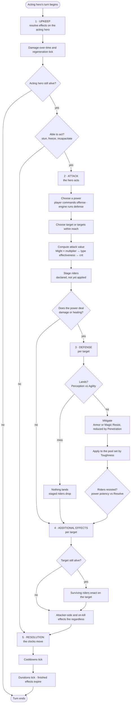

# LMNTLZ · Mechanics 04 — The Turn

A turn belongs to **one hero** — the *acting* hero. Everything below happens
inside that hero's turn, in this order, every time. **There are no interrupts:**
nothing a defender does can pause, reorder or pre-empt the sequence. In the
Defense phase a defender contributes its stats and nothing more.

Whether a defender may ever *act* — a counter or riposte, resolved inside the
attacker's phase 4 rather than out of sequence — is an open question, not a
settled no. See *Open* below.

**The phase order is the attacker's.** This is the single most useful thing to
hold onto, because it answers most questions about edge cases before they get
asked. A defender dying mid-turn is an *event inside* the acting hero's turn,
not something that can end it. The only death that stops the sequence is the
acting hero's own, and the only place that can happen is Upkeep.

This file covers what happens **within** a turn first, then who acts next and
how often — `Speed`, settled at the end.

---

## The five phases

| # | Phase | Resolves | Runs |
|---|---|---|---|
| 1 | **Upkeep** | Effects already on the acting hero — damage over time, crowd control, anything ticking | Always |
| 2 | **Attack** | Power choice, target choice, attack value. Riders are *staged*, not applied | Unless the hero cannot act |
| 3 | **Defense** | Evasion, mitigation, resistance. Damage or healing lands here | Per target — **skipped** if the power does neither |
| 4 | **Additional effects** | Riders enact. For a power with no damage or healing, they are contested here too | Per target |
| 5 | **Resolution** | Cooldowns tick. Durations tick. Timed effects expire | Always |

The split that carries the design: **phase 2 computes, phase 3 decides.** The
attacker never knows what it dealt until the defender has had its say. Riders
work the same way — staged in Attack, contested in Defense, enacted in
Additional Effects.

---

## Flow

Three branches deserve calling out, because all three are forced rather than
chosen:

- **A hero that cannot act still reaches Resolution.** Otherwise a stun would
  tick down only on turns where the victim was already free to act, and no
  crowd control would ever expire. Losing the turn skips phases 2–4, never 5.
- **Death in Upkeep ends the turn immediately.** A hero killed by its own
  damage-over-time never acts, so there is nothing for phases 2–4 to do. This
  is the *only* way the sequence terminates early.
- **A target dying never ends the sequence.** It is the attacker's turn. The
  corpse stops receiving things; the turn carries on.

There is also a **third way to lose the action**, which falls out of the reach
rule rather than from anything here: a hero with **no legal target in reach**
passes. At full formation the back-row hero cannot touch an enemy at all
(`02-squads.md`), so this is an ordinary occurrence, not an edge case — and a
pass still reaches Resolution, so it still recharges.

---

## What each phase does

### 1 · Upkeep — the bill comes due

Everything already attached to this hero resolves **on this hero's own turn**,
not on the turn of whoever applied it. A poison you inflict ticks when your
victim acts.

Because durations tick on the same clock (phase 5), **a damage-over-time effect
deals its full total no matter how fast its bearer is** — a 3-turn burn ticks
exactly three times. What `Speed` changes is the rate: a fast hero takes it
compressed into fewer rounds and is clean sooner. See *One clock per hero*
below.

Upkeep is also where a hero discovers it has lost the turn. Crowd control is
*resolved* here — checked, applied, and this is where "you are stunned, you do
not act" is decided.

### 2 · Attack — declare, don't apply

The acting hero picks a power and a target. **The player commands offense; the
engine commands every defense squad** — so on defense this is where the AI
chooses, which is why `07-defense-ai.md` is a turn-phase problem and not a
separate system.

The attack value is computed here in full: base damage from `Might` and the
power's multiplier, then type effectiveness from the Bane/Fault derivation,
then crit. What is **not** done here is anything to the target — no damage, no
status. Riders are *staged*: declared, carried into the next phase, and still
capable of being refused.

### 3 · Defense — the target answers

**Phase 3 exists to move a number against a health pool.** If a power deals
neither damage nor healing, there is nothing here for it to do and the phase is
skipped entirely — see *Powers that skip Defense* below.

Otherwise, per target, in order: does it land, how much is absorbed, apply the
remainder, then contest each staged rider.

`Perception` vs `Agility` decides landing. A miss ends resolution for that
target and its staged riders drop with it. Mitigation is `Armor` for the three
martial types and `Magic Resist` for the six arcane ones, both reduced by the
attacker's `Penetration`. What survives comes off the pool that `Toughness`
sets. Healing runs the same phase — it is the same operation with the sign
reversed, and it is reach-limited exactly as an attack is.

Riders are contested separately from the damage — power potency against
`Resolve` — so a hit can land its damage and still fail to land its debuff.

### 4 · Additional effects — riders enact

Whatever survived phase 3 now happens: applied debuffs, buffs, lifesteal,
chained or splash effects, anything the power promised beyond its number.

**Dead targets receive nothing.** A rider never lands on a corpse. But the
phase still runs — **attacker-side and on-kill effects fire regardless**,
because the target's death is an event inside the attacker's turn, not a stop
condition for it. Lifesteal from the killing blow pays out; poison applied to
the body does not.

**The phase runs per target.** A power that hits three enemies resolves its
riders three times, once against each. A rider that should happen **once per
cast** rather than once per target — a flat self-buff, say — is therefore a
property the *power* has to declare, following the existing convention in
`01-stats.md` that any deviation from the pipeline must be stated explicitly.

### 5 · Resolution — the clocks move

**Cooldowns tick here.** Powers recharge in whole turns, and Resolution is
where that counter moves. Resolution is also the only phase that always runs,
which means a hero that loses its turn to a stun still recharges — the stun
costs it the action, not the recovery.

Durations tick in the same phase, and anything that has run out expires. One
phase, one place where time passes, and it is unconditional. That is what makes
timed effects trustworthy.

**Both tick only for the hero whose turn it is.** A duration counts down on its
**bearer's** turn, exactly as damage-over-time ticks on its bearer's turn in
Upkeep — the two must use the same clock or they desynchronise. If every effect
on the board ticked on every hero's turn, a 3-turn burn facing a full 12-hero
board would expire after a quarter of a round having dealt damage once. "Turns"
in a duration always means *the bearer's own turns*.

A consequence, and the reason Resolution ticking **last** matters: an effect
applied during this turn is applied in phase 4, survives this turn's Resolution
at full duration, and only starts counting on its bearer's next turn. **A
1-turn buff is always usable once.**

### Powers that skip Defense

A power that deals no direct damage and no healing — a pure buff, a pure
debuff, a reposition — has nothing for phase 3 to mitigate, so **phase 3 is
skipped and the whole effect resolves in phase 4**, including its `Resolve`
contest.

The asymmetry is deliberate rather than an oversight. Phase 3 is where the
target physically answers an incoming blow; with no blow, the only question
left is whether the effect sticks, and that is asked at the moment it tries to
land. The practical rule:

> **Damage or healing → contested in phase 3, enacted in phase 4.**
> **Neither → contested and enacted together in phase 4.**

Note that a pure debuff cannot be *evaded* — skipping phase 3 skips the
`Perception` vs `Agility` roll along with everything else. Dodging is a defense
against blows, not against curses; `Resolve` is the only thing standing between
a hero and a pure debuff.

---

## How this maps to the damage pipeline

`01-stats.md` specifies an eight-step damage resolution pipeline. It is not a
separate model — it is **phases 2–4 in detail**:

| Pipeline step | Phase |
|---|---|
| 1 · Act | *outside* — turn order, still open |
| 2 · Land | 3 · Defense |
| 3 · Base | 2 · Attack |
| 4 · Type | 2 · Attack |
| 5 · Crit | 2 · Attack |
| 6 · Mitigate | 3 · Defense |
| 7 · Apply | 3 · Defense |
| 8 · Status | 3 · Defense *(contested)* → 4 · Additional effects *(applied)* |

**One ordering changed.** The pipeline listed *Land* as step 2, before base
damage was computed; the phase structure computes the whole attack value first
and tests landing in the Defense phase. The outcome is identical for an
ordinary attack — a miss voids the damage either way — but it is not identical
for a power with an **on-miss rider**, which now has a fully-computed attack
value available to scale from. The phase structure wins; `01-stats.md` step 2
should be read as "resolved in the Defense phase."

Pipeline step 8 is the only one that splits across two phases, and that split
is the point: **contested in Defense, enacted in Additional Effects** — except
for a power that skips Defense, where both happen in phase 4.

---

## Settled

The five phases, their order, and:

- A turn belongs to the **acting** hero; the phase order is the attacker's.
- Upkeep resolves effects **on the acting hero**, on its own turn.
- Losing the turn to crowd control skips phases 2–4 but **always** reaches 5.
- The acting hero dying in Upkeep is the **only** early termination.
- Riders **stage** in Attack and are **contested** in Defense.
- Phase 3 is **skipped** when a power deals neither damage nor healing; that
  power's effect is contested and enacted together in phase 4.
- Phases 3 and 4 both run **per target**.
- **Dead targets receive no follow-on effects**, but the phase still runs and
  attacker-side effects still fire.
- **Cooldowns tick in Resolution**, unconditionally.

## Open

- **Reactive powers.** Whether a defender may fire a counter or riposte inside
  the attacker's phase 4. The Turn Sequence screen proposes yes, resolved one
  layer deep and explicitly forbidden from triggering another reaction —
  otherwise two counter-built squads loop forever on a single strike. It fits
  the phase structure without disturbing it, and it is a real addition to the
  action space rather than a restatement. **Not adopted; awaiting a decision.**
- **Once-per-cast riders.** Phase 4 running per target means a power needing a
  single flat self-buff has to say so. Whether that is a per-power flag, a
  separate rider category, or simply a rule that self-targeted riders always
  resolve once, is a `03-powers.md` decision — named here so it isn't lost.
- **Turn order and action economy.** Below.

---

## Between turns: what Speed does

Phase 1 of the damage pipeline — **Act** — is the one step that happens between
turns rather than inside one. It is now settled:

> **`Speed` sets initiative order, and faster heroes act more often.**
> Cooldowns are never touched directly by `Speed`; a cooldown counts **hero
> turns**, ticking once per turn its owner takes.

Nothing above changes. Extra turns simply run the five phases again, which is
why the intra-turn structure could be settled first.

### One clock per hero

Every timed quantity in the game counts the **bearer's own turns**: cooldowns
tick in that hero's Resolution, durations tick in that hero's Resolution,
damage-over-time ticks in that hero's Upkeep. Nothing counts rounds and nothing
counts anybody else's turns.

So `Speed` is not just "more actions" — **it is a rate multiplier on the whole
timed layer for that hero.** A fast hero gets its powers back sooner, watches
its own buffs expire sooner, shakes off control sooner, and burns through a
poison sooner. A slow hero lives in slow motion in every one of those respects.

Two things follow that are worth having before any tuning happens:

- **A duration costs its bearer the same total, whatever its Speed.** A 3-turn
  burn ticks exactly three times, because both the tick and the countdown are
  driven by the same clock. `Speed` changes *when* that damage arrives, not how
  much — fast heroes take it compressed into fewer rounds, slow heroes take it
  strung out. This is a happier answer than the one sketched earlier in this
  file: acting more often is **not** a damage-over-time penalty.
- **Control is weaker against fast heroes, in the only units that matter.** A
  3-turn stun costs any hero three actions, but the fast hero spends them over
  far less of the battle and rejoins sooner. Combined with the cooldown effect,
  `Speed` is plausibly the strongest of the ten stats — it should be priced as
  one, and it is the first place to look if the roster reads as lopsided.
